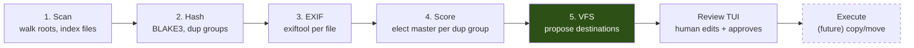
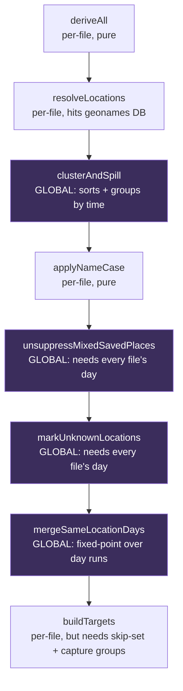
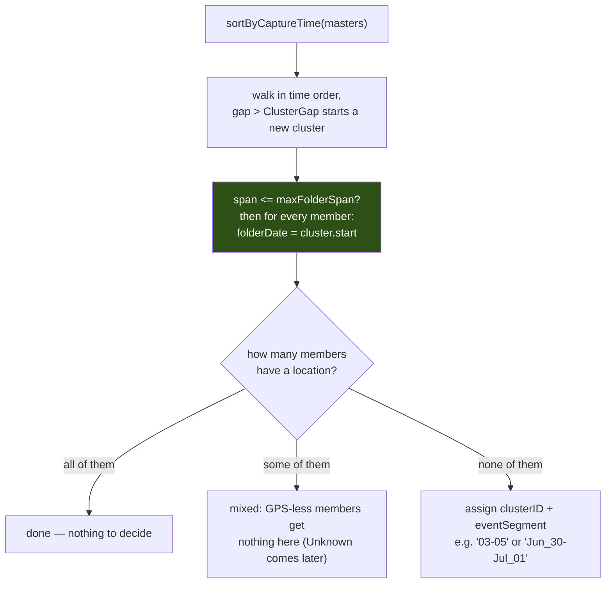
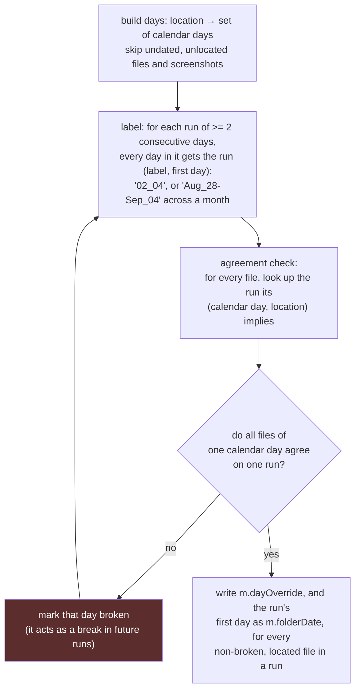
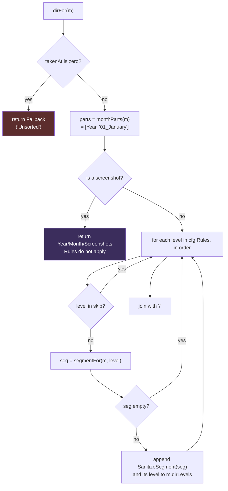
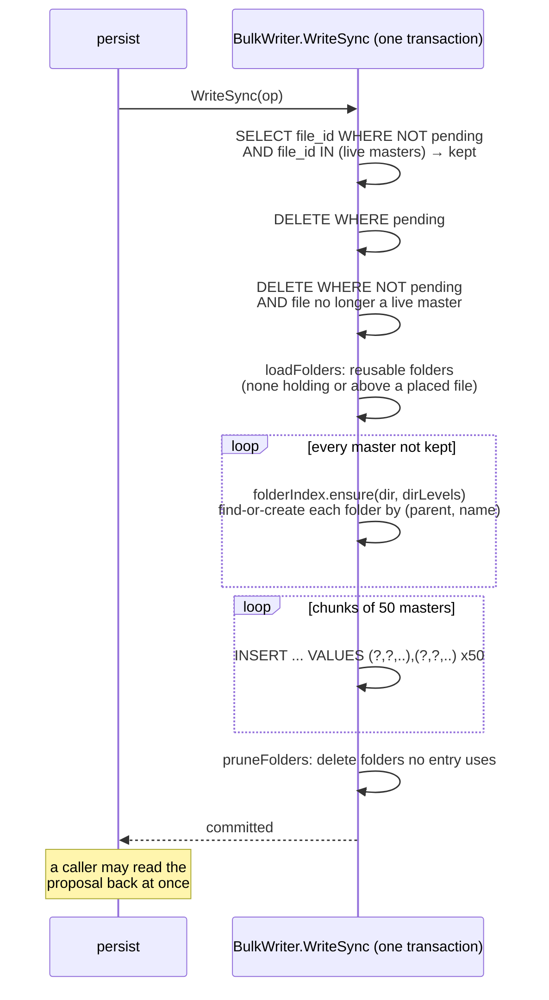
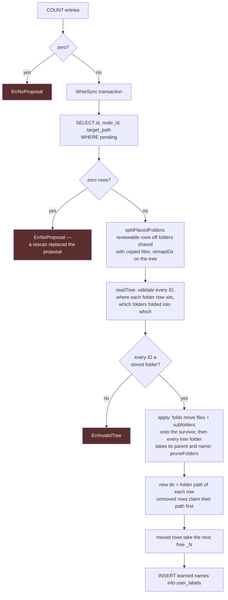

<!--
Copyright (c) 2026 Utkarsh Chourasia

This file is part of WanderSort.

SPDX-License-Identifier: AGPL-3.0-or-later
-->

# The VFS Phase, End to End

*A walkthrough of `pkg/core/vfs`: every SQL query, every pass, every
concurrency pattern, and every edge case that made one of them necessary.*

---

## Table of contents

1. [What the VFS phase actually is](#1-what-the-vfs-phase-actually-is)
2. [Where it sits in the pipeline](#2-where-it-sits-in-the-pipeline)
3. [Reading the library: `loadMasters` and its SQL](#3-reading-the-library-loadmasters-and-its-sql)
4. [`Plan()`: eight passes, and why they run in that order](#4-plan-eight-passes-and-why-they-run-in-that-order)
   - [4.1 `deriveAll` — turning EXIF strings into facts](#41-deriveall--turning-exif-strings-into-facts)
   - [4.2 `resolveLocations` — GPS to a city name](#42-resolvelocations--gps-to-a-city-name)
   - [4.3 `clusterAndSpill` — events, not calendar days](#43-clusterandspill--events-not-calendar-days)
   - [4.4 `applyNameCase` — cosmetics with one trap](#44-applynamecase--cosmetics-with-one-trap)
   - [4.5 `unsuppressMixedSavedPlaces` — the half-sorted day](#45-unsuppressmixedsavedplaces--the-half-sorted-day)
   - [4.6 `markUnknownLocations` — naming the absence](#46-markunknownlocations--naming-the-absence)
   - [4.7 `mergeSameLocationDays` — the fixed-point loop](#47-mergesamelocationdays--the-fixed-point-loop)
   - [4.8 `uninformativeLevels` — collapsing what says nothing](#48-uninformativelevels--collapsing-what-says-nothing)
   - [4.9 `buildTargets` and `dirFor` — the actual path](#49-buildtargets-and-dirfor--the-actual-path)
   - [4.10 `captureDirs` — the one exception to per-file derivation](#410-capturedirs--the-one-exception-to-per-file-derivation)
5. [Writing it down: `persist`, the FIFO writer, and the flush](#5-writing-it-down-persist-the-fifo-writer-and-the-flush)
6. [Where the settings live](#6-where-the-settings-live)
7. [Review: one tree, and confirmation](#7-review-one-tree-and-confirmation)
8. [Concurrency patterns, all of them](#8-concurrency-patterns-all-of-them)
9. [The edge-case catalogue](#9-the-edge-case-catalogue)
10. [Known ceilings](#10-known-ceilings)
11. [Appendix: schema and glossary](#11-appendix-schema-and-glossary)

---

## 1. What the VFS phase actually is

WanderSort's promise is: point it at a pile of photos, get back an organised
folder tree. The VFS phase is where "organised folder tree" stops being a
promise and becomes a concrete list of `source → target` pairs.

Three things it is **not**, and each one explains a design decision downstream:

**It never touches the filesystem.** Not to read a file, not to create a
folder, not to move anything. Every fact it needs was extracted by earlier
phases and lives in SQLite. That is why the whole thing can re-run in about a
second on a 15,000-file library: saving changed settings re-proposes the
entire hierarchy without re-hashing a byte.

**It is not scoped to the current scan.** It plans for *every live master file
in the library*, not just the ones this run discovered. This matters more than
it sounds. If the phase only planned this run's files, then adding one photo
from Goa to a library that already had ten would produce a different tree than
scanning all eleven at once — the output would depend on your scan history,
which is a terrible property for something meant to be deterministic. Instead,
every run re-derives the whole library and replaces the pending part of the
plan wholesale.

**It is not a decision.** A row has no status of its own: it is *pending* while
its file is unplaced (`file_registry.placed = 0`) with no `TRANSFER` row in
`errors`. A human edits it in the review TUI. Nothing moves until the Execute
phase reads the pending rows.

So the shape of the phase is:

```
SQL read  →  pure in-memory transformation  →  SQL write
```

with the middle bit — `Plan()` — being a pure function of `(masters, config)`.
No database handle, no filesystem, no clock. That is deliberate: it means the
entire folder-naming logic is testable by stating a slice of structs and
asserting on strings, which is exactly what `plan_test.go` does.

---

## 2. Where it sits in the pipeline



There is no scan status column. A file is *read* once it has a `file_metadata`
row (hash and EXIF are written together); one that could not be read has a
`READ` row in `errors` instead. The VFS phase reads files that made it through
that, and writes to a different table entirely (`virtual_fs_entries`).

Two dependency notes that shape the concurrency story later:

- The VFS phase is the **only** phase that needs the geonames location
  database. That is why `install.Coordinator` downloads exiftool *first* (the
  EXIF phase, earlier, is blocked on it) and the location DB *second* — the big
  download has the entire scan and hash to hide behind.
- The VFS phase is the **only** phase that reads the user's folder-shaping
  settings. Every phase above it has already used what it needed from config.
  That is what makes a settings re-plan cheap: it re-runs this phase alone.

---

## 3. Reading the library: `loadMasters` and its SQL

```sql
SELECT fr.id, fr.file_dir, fr.file_name, fr.media_type, fr.file_extension,
       fr.file_modified_at,
       fm.exif_image_width, fm.exif_image_height, fm.exif_orientation,
       fm.exif_gps_latitude, fm.exif_gps_longitude,
       fm.exif_make, fm.exif_model, fm.exif_date_time_original,
       fm.exif_create_date, fm.exif_creation_date, fm.exif_media_create_date,
       fm.is_screenshot
FROM file_registry fr
JOIN file_metadata fm ON fm.file_id = fr.id
WHERE fm.is_master = 1 AND fr.placed = 0
ORDER BY fr.file_dir, fr.file_name
```

Four things in there earn their place:

**`file_registry`, with no view in front of it.** There used to be a
`live_files` view (`SELECT * FROM file_registry WHERE deleted_at IS NULL`):
WanderSort soft-deleted a vanished file, stamping `deleted_at` rather than
dropping the row, with a 30-day grace window before a hard purge. That's
gone (spec D10: only what is in the library matters) — the scanner's `sweep`
now hard-deletes a vanished file's row, and its `file_metadata` and
`virtual_fs_entries` rows, immediately, in one transaction. Nothing is ever
soft-deleted any more, so a view that filtered `deleted_at IS NULL` had
nothing left to filter, and every reader queries `file_registry` directly.

**`fr.placed = 0`.** A placed file (`execute` has already landed it at its
target, copy or move alike) is never a candidate here at all — its
row already *is* the plan, and re-reading it into `masters` would let it
compete for a fresh proposal it can't have (`persist`'s `UNIQUE(file_id)`
would reject a second row for the same file, but the read should never get
that far to begin with). See §4's scorer note for the other half of this:
even before this filter runs, a placed file can never lose the election that
sets `is_master`.

**`is_master = 1`.** The scorer phase elects one master per duplicate group.
If you have the same photo in `Downloads/`, `Desktop/`, and `Trips/Goa 2024/`,
only one of them gets planned — and the scorer picked the one in the
best-named folder, because folder naming is a signal about what the file is.
Unless one of them is already placed, in which case that one wins outright,
no scoring: a file that already landed at its target beats any path
heuristic about where a not-yet-placed duplicate merely looks like it should
live (spec D11, the SD-card re-import case — see `pkg/core/scorer`).

**`ORDER BY fr.file_dir, fr.file_name`, not `ORDER BY id`.** This is subtle and
important. Two later stages are order-sensitive:

- **Clustering** sorts by capture time, but that sort is stabilised by original
  index — so the input order decides ties.
- **Collision suffixes** (`IMG_001.jpg`, `IMG_001_2.jpg`) are assigned
  first-come-first-served in `buildTargets`.

`id` is assigned by whichever scanner worker got there first, so it varies run
to run. Path order is stable across machines and across runs. Without this
clause, two identical scans of the same library could produce different
`_2` suffixes.

**`file_modified_at` comes along** even though it's not EXIF: it's the
last-resort timestamp fallback for a file with no EXIF dates at all (a `.AAE`
sidecar, a scanned image).

The result rows land in `[]masterFile` — one wide struct per file carrying both
the raw DB columns (`DB*`-prefixed pointers, nullable) and the derived fields
the passes fill in (`takenAt`, `location`, `device`, `targetPath`, …). Every
pass below reads and writes that one slice in place.

---

## 4. `Plan()`: eight passes, and why they run in that order

```go
func Plan(ctx, masters, cfg, geo, log) error {
    deriveAll(ctx, masters, cfg.Workers)
    resolveLocations(ctx, masters, cfg, geo, log)
    clusterAndSpill(masters, cfg.ClusterGap)
    applyNameCase(ctx, masters, cfg.Workers)
    unsuppressMixedSavedPlaces(masters, cfg)
    markUnknownLocations(masters, cfg)
    mergeSameLocationDays(masters, cfg)
    buildTargets(ctx, masters, cfg)
    return ctx.Err()
}
```

Eight calls. Each is a full pass over every master. That is not the fastest
possible arrangement — you could fuse several of them — but every pass after
the first two needs *library-wide* knowledge that only exists once the pass
before it has finished for every file. You cannot decide "is this location
level uninformative?" while still deriving locations.



Purple = a pass that cannot be parallelised per-file because it needs a
global view. That distinction is the whole concurrency story of this phase,
and §8 comes back to it.

Three ordering constraints are load-bearing, and each one was a bug once:

1. **`clusterAndSpill` before everything that reads a month.** Clustering is
   what assigns `folderDate` — the timestamp the Year/Month folders come from.
   Anything that groups by month before that runs would group by the wrong
   month.
2. **`unsuppressMixedSavedPlaces` before `markUnknownLocations`.** Un-suppressing
   a saved place's city folder is what makes the GPS-less files next to it look
   "loose" and therefore deserve an `Unknown` folder. Reverse the order and both
   piles sit loose together.
3. **`markUnknownLocations` before `mergeSameLocationDays`.** Once an unlocated
   file is named `Unknown`, it is a location like any other, and its days fold
   into ranges on the same terms as everyone else's. Reverse the order, and the
   GPS-less files are the only ones left un-merged — which reads as a bug even
   though every individual rule fired correctly.

---

### 4.1 `deriveAll` — turning EXIF strings into facts

The EXIF phase stored exiftool's output as **strings**, exactly as exiftool
printed them. `deriveAll` parses them.

#### The timestamp ladder

```go
m.takenAt = firstTime(
    deref(m.DBDateTaken),                    // EXIF DateTimeOriginal
    stripOffset(deref(m.DBCreationDate)),    // QuickTime CreationDate (iOS)
    deref(m.DBCreateDate),                   // QuickTime CreateDate
    m.ModifiedAt,                            // file mtime — last resort
)
```

`firstTime` returns the first candidate that parses. Order matters enormously
and is worth walking through with a real file:

```
IMG_3341.MOV
  CreateDate    : 2026:01:01 11:20:54          ← UTC, no offset
  CreationDate  : 2026:01:01 16:50:54+05:30    ← local wall clock + offset
```

Both describe the same instant. They are 5.5 hours apart as written. A photo
taken at the same moment on the same phone would carry
`DateTimeOriginal: 2026:01:01 16:50:54` — **naive local wall clock, no offset
at all**.

So: if you used `CreateDate` for videos, every video would land 5.5 hours before
its neighbouring photos, and near midnight it would land in the previous day's
folder. That was a real reported bug. Hence `CreationDate` ranks above
`CreateDate`.

But `CreationDate` carries `+05:30`, and `time.Parse` with an offset produces
an instant in a *different* zone from the naive photo timestamps. Comparing
them, or calling `.Day()` on them, would reintroduce the same shift from the
other direction. So:

```go
func stripOffset(s string) string {
    s = strings.TrimSuffix(s, "Z")
    if i := strings.LastIndexAny(s, "+-"); i >= 0 {
        return strings.TrimSpace(s[:i])
    }
    return s
}
```

`2026:01:01 16:50:54+05:30` becomes `2026:01:01 16:50:54`, which parses to the
same naive wall-clock a photo would give. Every timestamp in the system is
therefore naive local wall clock, uniformly. **The rule: WanderSort does not
know or care what timezone you were in. It cares what the clock on the wall
said.** That is the right model for organising holiday photos — you remember
"the evening of the 1st", not an instant in UTC.

> Why is `LastIndexAny(s, "+-")` safe? Exiftool date strings use **colons** as
> separators (`2026:01:01`), never hyphens. So the only `+` or `-` in the string
> is the offset. If the format ever changes, this breaks silently — one of the
> reasons `TestStripOffset` exists.

#### The parse-layout ladder

```go
var looseTimeLayouts = []string{
    "2006:01:02 15:04:05",                     // the common case, first
    "2006:01:02 15:04:05.999999999-07:00",
    "2006:01:02 15:04:05-07:00",
    "2006:01:02 15:04:05.999999999",
    time.RFC3339Nano,
    time.RFC3339,
    "2006-01-02 15:04:05",
    "2006-01-02",
}
```

Tried in order, first success wins. The plain exiftool shape leads because
every layout ahead of it would be a guaranteed failed parse for ~99% of files —
`time.Parse` failure isn't free, and this runs once per file per candidate.

#### Orientation

```go
if o := m.DBOrientation; o != nil && *o >= 5 && *o <= 8 {
    m.width, m.height = m.height, m.width
}
```

EXIF orientation values 5–8 mean "the pixels are stored rotated 90° or 270°".
A portrait phone photo is frequently stored as a landscape pixel buffer plus an
orientation tag. If you asked "is `width > height`?" of the raw buffer you'd
call every portrait shot Horizontal. Swapping here means the `orientation`
folder level reflects how the shot is *viewed*, which is what a person means by
"vertical".

#### Device name

```go
func deviceName(mk, model string) string {
    switch {
    case model == "":                                    return mk
    case mk == "" || strings.Contains(lower(model), lower(mk)): return model
    default:                                             return mk + " " + model
    }
}
```

Canon writes `Make: Canon`, `Model: Canon EOS R5`. Naively joining gives
`Canon Canon EOS R5`. Apple writes `Make: Apple`, `Model: iPhone 13`, which
*does* need joining to `Apple iPhone 13`. One containment check covers both.

---

### 4.2 `resolveLocations` — GPS to a city name

Two steps per GPS-tagged file: reverse-geocode, then fold into a saved place.

#### Reverse geocoding

The geonames database is a read-only SQLite file (`location.db`, opened
`mode=ro`, which is why several WanderSort processes never contend for it).
The query:

```sql
WITH params AS (SELECT ? AS lat, ? AS lon, ? AS delta)
SELECT gc.city,
       (gc.latitude  - p.lat) * (gc.latitude  - p.lat) +
       (gc.longitude - p.lon) * (gc.longitude - p.lon) AS dist,
       COALESCE(gc.state, ''), COALESCE(gc.country, ''),
       COALESCE(gc.country_code, '')
FROM   geonames_cities gc, params p
WHERE  gc.latitude  BETWEEN p.lat - p.delta AND p.lat + p.delta
AND    gc.longitude BETWEEN p.lon - p.delta AND p.lon + p.delta
ORDER  BY dist
LIMIT  ?
```

Notice what this is *not* doing: no haversine, no trigonometry, no spatial
index extension. It is a **bounding-box filter that an ordinary B-tree index on
latitude can serve**, followed by ranking on squared Euclidean distance in
degree space.

Is that wrong? Technically yes — a degree of longitude is ~111 km at the equator
and ~0 km at the poles, so degree-space distance distorts as you go north. For
picking the nearest city out of a handful of candidates within 50 km, the
distortion never changes the answer, and it costs one multiply instead of four
trig calls per row. Squared, too — no `sqrt`, because we only ever compare.

Two passes, widening:

```go
for _, delta := range []float64{NearSearchDegrees /*0.09 ≈ 10km*/,
                                farSearchDegrees  /*0.45 ≈ 50km*/} {
```

Most photos are near a city, so the tight box usually hits and scans very few
rows. The wide box is the fallback.

`farSearchDegrees` is `sqrt(MaxDistSquared)` — **they must match**. They didn't
once, and the result was that a valid city 15–40 km away was found by the query
and then silently rejected by the acceptance check, fragmenting locations for
no visible reason.

#### The cache and its grid

```go
key := cacheKey{
    lat: math.Round(lat*100) / 100,
    lon: math.Round(lon*100) / 100,
}
```

Two decimal places ≈ 1.1 km. Every photo taken around one place shares a cache
entry despite GPS jitter. The cache is a `sync.Map`, so the parallel workers
share it without a lock on the read path.

Two details:

- **The query uses the real coordinates, not the rounded ones.** The rounding
  exists only to share a cache *key*. Querying the square's centre would move
  the query point up to half a cell away from where the photo was actually
  taken.
- **Misses are cached too**, but only `ErrNoLocation` misses. A library shot far
  from any populated place would otherwise re-run both the tight and wide
  passes for every single file. A *cancelled context* or a *failed query* says
  nothing about the coordinates and stays retryable — caching that would poison
  the run.

There is deliberately **no singleflight**. On a cold cache, several workers can
issue the identical query for the same square. That's a duplicated read against
a local read-only SQLite file — cheap enough that a singleflight's coordination
would cost more than it saved.

#### The anchor fold

```go
for _, a := range cfg.Anchors {
    dLat, dLon := m.lat-a.Lat, m.lon-a.Lon
    if dLat*dLat+dLon*dLon <= location.MaxDistSquared {
        m.location = a.FolderName
        m.atSavedPlace = true
        break
    }
}
```

Anchors are your saved places from the library's settings (home town, work town, others)
resolved to coordinates. Without this fold, living in a metro means your
everyday photos fragment across every suburb geonames knows about — `Vijay
Nagar`, `Rau`, `Bhawarkuan`, all of which are Indore. Folding within ~50 km
collapses them into one `Indore`.

`atSavedPlace` is then a *fact* the later passes read: "this file was taken
somewhere the user considers everyday". It is separate from
`keepLocationFolder`, which is a *decision* about whether to show the folder.
Keeping the fact and the decision in separate fields is what lets
`unsuppressMixedSavedPlaces` reverse the decision without lying about where the
photo was taken.

---

### 4.3 `clusterAndSpill` — events, not calendar days

This is the pass with the most interesting failure history.

#### The idea

People shoot in bursts. A trip is a cluster of captures separated from the next
cluster by a long gap. `clusterAndSpill` sorts every master by capture time and
starts a new cluster whenever the gap to the previous file exceeds
`ClusterGap` (default 12 hours).



#### `folderDate`: one event, one month folder

The green box is the important one:

```go
if c.end.Sub(c.start) <= maxFolderSpan {
    for _, i := range c.members {
        masters[i].folderDate = c.start
    }
}
```

**Every member of a *short* cluster takes the cluster's start time as its
folder date.** Not its own capture time.

Why: a New Year's Eve party starts 2025-12-31 20:00 and ends 2026-01-01 03:00.
Without this, half the photos go to `2025/12_December/` and half to
`2026/01_January/` — one event torn across two *Year* trees, which is about the
worst possible outcome for something whose entire job is grouping.

Why the span cap (`maxFolderSpan`, 24h): a cluster grows for as long as
consecutive shots stay inside `ClusterGap`, so a holiday shot every few hours
is *one* cluster running for a week. Handing all of it the start month files
the Jan 05 photos under `2025/12_December/Jan_05` — a reported bug, and the
same "wrong Year tree" failure the rule exists to prevent, just in the other
direction. Past a day it is a trip, not one sitting: every file keeps the month
it was shot in, and `mergeSameLocationDays` folds the days into ranges as
usual. The cap is a whole-cluster decision, never per member, so one day can
never be split across two month folders.

`folderDate` is read through an accessor, never directly:

```go
func (m *masterFile) folderTime() time.Time {
    if m.folderDate.IsZero() {
        return m.takenAt
    }
    return m.folderDate
}
```

The zero case exists because `PreviewPaths` (the config wizard's live example
renderer) builds synthetic masters and never clusters them. One accessor means
`dirFor`, `locationParent`, `mergeSameLocationDays` and `persist` cannot
disagree about which month a file is in — and there is exactly one place to
change if the rule ever changes.

> **This is where the bug you found lived.** Year and Month came from
> `folderTime` (the cluster start), but the *Day* folder came from
> `m.takenAt.Day()` — the file's own day. A Jan 1 file in a Dec 31 cluster got
> `2025/12_December/` + day `01`, which reads as **December 1st** and, worse,
> landed in the same folder as the library's genuine December 1st photos.
>
> The fix: `crossesFolderMonth(m)` reports when a file's own month differs from
> its cluster's month. Such a file gets a month-qualified day folder
> (`Jan_01`, matching `eventSegment`'s existing cross-month shape) unless the
> day-merge puts it in a run: runs are numbered by calendar date, so a run
> crossing a month or year end is one run under its first day's month
> (`Aug_28-Sep_04`, spec D27). Either way the file states its full date
> (`fullDate`) in its folders' bounds, so later batches match it by the day it
> was actually shot.

#### `sortByCaptureTime`: the cycle permutation

This is a performance detail, but a nice one.

```go
type sortKey struct {
    sec  int64
    idx  int
    nsec int32
}
```

`masterFile` is a 408-byte struct. Sorting a slice of them means the sort moves
408 bytes per swap and touches cache lines the comparison never reads. So
instead: build a 24-byte key per master, sort the keys, then apply the
permutation to the real slice.

Applying a permutation naively needs a scratch slice — 41 MB at 100k files,
which must be zeroed before you write a byte to it. Instead it follows cycles:

```go
for k := range keys {
    if keys[k].idx == k { continue }        // already placed
    held := masters[k]                       // lift one element out
    cur := k
    for {
        src := keys[cur].idx
        if src == k { break }                // cycle closed
        masters[cur] = masters[src]
        keys[cur].idx = cur                  // mark placed
        cur = src
    }
    masters[cur] = held
    keys[cur].idx = cur
}
```

Every master moves exactly once. `keys[i].idx = i` doubles as the "already
placed" marker, so the outer loop skips anything a cycle handled. Zero
allocation beyond the key slice.

Two correctness notes:

- `sec` + `nsec` rather than `UnixNano()`: an undated file has `takenAt ==
  time.Time{}` (year 1), and `UnixNano` on that **overflows int64**. `Unix()`
  doesn't.
- `idx` in the key is what makes an unstable sort stable, which is what lets it
  use the faster `slices.SortFunc`.

#### `eventSegment`: dating what has no place

A cluster where *nothing* resolved to a location gets a dated placeholder
instead of a name:

```go
func eventSegment(start, end time.Time) string {
    switch {
    case sameDay(start, end):    return start.Format("02")            // "03"
    case sameMonth(start, end):  return "02" + "-" + "02"             // "03-05"
    default:                     return "Jan_02" + "-" + "Jan_02"     // "Jun_30-Jul_01"
    }
}
```

#### What `clusterAndSpill` deliberately no longer does

The name still says "spill" for historical reasons. It used to give a cluster's
GPS-less members the majority city of its located ones. That produced a real,
reported, badly wrong result:

- A 12-hour cluster is most of a day. A DSLR shot nine hours after a phone photo
  inherited the phone's city.
- Most GPS-less files sit near a saved place, so in practice nearly every
  GPS-less file in a library got named after the user's home town.
- In one real 15,000-file library, the word `Unknown` never appeared **once**,
  because spillover had already consumed every candidate.

The rule now: **no GPS, no place.** A mixed cluster decides nothing and assigns
no `cluster_id`. Only a cluster with *nothing* located decides anything at all
(the dated event segment). If the reviewer knows better, `[V]` + `[m]` merges
the `Unknown` folder into its neighbour in two keystrokes — a human decision
recorded as a human decision, rather than a guess laundered into the data.

---

### 4.4 `applyNameCase` — cosmetics with one trap

Title-cases derived location and device names. Filenames are left strictly
alone.

```go
var caseWhitelist = map[string]string{"iphone": "iPhone"}
```

Word-by-word title-casing turns `iPhone 13` into `Iphone 13`, which looks
broken to anyone who owns one. The whitelist is matched case-insensitively and
is meant to grow as more names turn up.

Note this runs **after** `resolveLocations` and **before** everything that
compares location strings. If it ran later, `Goa` and `goa` could be treated as
two different places by the merge logic.

---

### 4.5 `unsuppressMixedSavedPlaces` — the half-sorted day

The `SavedPlacesDateOnly` setting says: for everyday places (home, work), don't
make a location folder. `2024/08_August/02/` full of home photos, not
`2024/08_August/02/Indore/` — because the folder would say the same thing every
single day and add a click to reach anything.

That's right when the whole day is everyday shots. It is **wrong the moment the
day holds anything else**:

```
2024/08_August/02/
├── IMG_001.jpg      ← home photos, loose
├── IMG_002.jpg
├── IMG_003.jpg
└── Unknown/
    └── DSC_9901.jpg
```

The day reads as half-sorted, and it was a real report. Two piles at different
nesting depths look like a bug even when both rules fired correctly.

So:

```go
// parent folder → does anything in it come from somewhere that isn't a saved place?
mixed := map[string]bool{}
for i := range masters {
    if m := &masters[i]; hasLocationLevel(m) && !m.atSavedPlace {
        mixed[locationParent(m, skip, cfg)] = true
    }
}
for i := range masters {
    m := &masters[i]
    if m.atSavedPlace && hasLocationLevel(m) && mixed[locationParent(m, skip, cfg)] {
        m.keepLocationFolder = true
    }
}
```

Result: `02/Indore/` **and** `02/Unknown/`. Never a bare pile next to a folder.

`locationParent` deserves a note. It is "everything `dirFor` would emit *above*
the location level":

```go
func locationParent(m *masterFile, skip map[string]bool, cfg Config) string {
    parts := monthParts(m)
    for _, level := range cfg.Rules {
        if level == RuleLocation { break }
        if skip[level] { continue }
        if seg := segmentFor(m, level, cfg); seg != "" {
            parts = append(parts, path.SanitizeSegment(seg))
        }
    }
    return strings.Join(parts, "/")
}
```

It walks the *configured* rules rather than assuming location sits at a fixed
depth. That's what makes "siblings" mean the right thing under
`rules: [date, location]`, `rules: [device, location]`, or any other order.

---

### 4.6 `markUnknownLocations` — naming the absence

Same shape, opposite direction:

```go
located := map[string]bool{}
for i := range masters {
    if m := &masters[i]; hasLocationLevel(m) && segmentFor(m, RuleLocation, cfg) != "" {
        located[locationParent(m, skip, cfg)] = true
    }
}
for i := range masters {
    m := &masters[i]
    if !hasLocationLevel(m) || m.atSavedPlace || segmentFor(m, RuleLocation, cfg) != "" {
        continue
    }
    if located[locationParent(m, skip, cfg)] {
        m.location = UnknownLocation   // "Unknown"
    }
}
```

The condition to read carefully is the guard: a file gets `Unknown` **only if
located siblings share its parent folder**.

Why the condition, rather than naming every unlocated file `Unknown`? Because a
folder whose files are *all* unlocated would get a single `Unknown` child
holding everything — one folder saying nothing the parent didn't already say,
and one extra click on the way to every file. `Unknown` is only informative as
a *contrast* to a real location next to it.

`m.atSavedPlace` is skipped explicitly: a suppressed saved-place folder is a
deliberate absence, not an unknown one.

And crucially, this pass writes to `m.location`. From here on, `Unknown` is a
location like any other — which is what lets the next pass fold its days into
ranges on the same terms as `Goa`'s.

---

### 4.7 `mergeSameLocationDays` — the fixed-point loop

The goal: `2024/08_August/{02,03,04}/Goa` should be `2024/08_August/02_04/Goa`.
A four-day trip is one folder, not four.

The invariant it must not break: **one day, one date folder.**

That invariant is what makes this pass complicated, and it is the one it
originally broke.

#### The failure it was written to fix

Runs of consecutive days are computed per `(year, month, location)`. But the
*folder* is per day. So one location's run could pull half a day into a range
and leave the rest of that day behind as a sibling. On a real 15k library that
produced:

```
2024/08_August/01_02/       ← Goa's run
2024/08_August/02/          ← the same day 2, for files at a different place
```

and, at worst, **day 28 in four different date folders** (`26_31`, `28`,
`28_30`, `28_31`). 37 torn days in total.

#### The algorithm



In code:

```go
broken := map[int]bool{} // calendarDay
for {
    label = /* recompute runs, excluding broken days */
    // ... one-label-per-day check ...
    if found { continue }   // a break can settle the runs around it — go again
    // ... apply dayOverride ...
    return
}
```

**Why a loop?** Because marking one day broken changes the runs around it. If
day 3 breaks, then the run `02_04` becomes two runs `02` and `04`, neither of
which is long enough to merge — which changes the labels of days 2 and 4, which
might resolve *their* disagreements. You have to reach a fixed point.

**Why does it terminate?** Each pass can only ever *add* to `broken`, never
remove. `broken` is bounded by the number of distinct days in the library. So
the loop runs at most `len(days)` times, and in practice one or two.

**"A file with no location votes for no range."** In the agreement loop, files
with no location aren't skipped — they look up `runs[""][day]`,
which is empty, so they vote for no run. If a located file in the same
day voted for `02_04`, the day disagrees and breaks. That's the correct answer:
otherwise the unlocated file would be left behind in a plain `02` folder while
its neighbours moved into `02_04`.

#### The cost

On a trip where each day holds several different places with different runs,
most days simply stay unmerged. That is a deliberate trade: a correct
un-merged tree beats an incorrect merged one, and the review TUI's `[V]`/`[m]`
exists precisely to fold days together when the human knows they belong.

#### Calendar days, and runs across a month

```go
func calendarDay(t time.Time) int // days since 1970 of t's date
```

A day is its calendar date, not its day-of-month, so 31 August and 1 September
are consecutive and a Goa trip from 28 August to 4 September is one run (spec
D27). The whole run goes under its **first day's** Year/Month: the merge writes
that day into every member's `folderDate`, so `monthParts` puts the September
days under `08_August` and the label is `eventSegment`'s cross-month shape,
`Aug_28-Sep_04` (`dayRange`; a run inside one month keeps `28_31`).

The September files are now `crossesFolderMonth`, so their folders' bounds get
their full date as one alternative (`fullDate`): `08_August` holds
`[{month:[8]}, {year:[2024], month:[9], date:[1,2,3,4]}]`. Kept together, not
as `month:[8,9]`, which would admit 28 September into August's plain `28`.

---

### 4.8 `uninformativeLevels` — collapsing what says nothing

Not a pass of its own — it's a helper, called by `unsuppressMixedSavedPlaces`,
`markUnknownLocations` and `buildTargets`, each of which needs the same
"which levels are we not rendering?" answer. It's cheap and deterministic, so
it's recomputed rather than threaded through.

```
2024/08_August/02/Goa/Apple iPhone 13/Vertical/Photos/IMG_001.jpg
```

Four folders deep to reach one folder, if every file in your library is a
vertical iPhone photo. Each of those levels has exactly one possible value, so
each is a directory you open without ever making a choice.

```go
func uninformativeLevels(masters []masterFile, cfg Config) map[string]bool {
    if !cfg.CollapseLevels { return nil }
    seen := map[string]map[string]bool{}
    for _, level := range cfg.Rules {
        if collapsibleLevels[level] { seen[level] = map[string]bool{} }
    }
    for i := range masters {
        for level := range seen {
            if seg := segmentFor(&masters[i], level, cfg); seg != "" {
                seen[level][seg] = true
            }
        }
    }
    skip := map[string]bool{}
    for level, values := range seen {
        if len(values) <= 1 { skip[level] = true }
    }
    return skip
}
```

Three design decisions in there:

**Only `device`, `orientation`, `media` collapse.** `date` and `location`
never do, no matter how uniform. Those are how a person *recognises* a folder —
you navigate to "August, Goa", not to "the vertical ones". And folding days
together is what `[m]` in the review TUI is for: a deliberate act, not an
automatic one.

**Measured library-wide, not per-branch.** A level that's kept under one Day and
dropped under the next would give the tree a different depth depending on where
you're standing, which is *worse* to navigate than one redundant folder. You'd
never build a mental model of the shape.

**It self-corrects.** `loadMasters` is library-wide and every run replaces the
proposal, so the first video a later scan finds brings the `Photos`/`Videos`
level back for the whole library, and re-proposes the existing photos into
`Photos/`. Nothing is stuck.

---

### 4.9 `buildTargets` and `dirFor` — the actual path

`dirFor` is the function everything above has been feeding.



#### The Year/Month prefix is not configurable

```go
func monthParts(m *masterFile) []string {
    t := m.folderTime()
    return []string{
        strconv.Itoa(t.Year()),
        t.Format("01_January"),     // "08_August"
    }
}
```

`01_January`, not `January`. A bare month name sorts alphabetically, which puts
`December` above `November` in `ls`, in Finder, and in the review tree. The
number prefix makes lexical order equal chronological order everywhere, for
free, forever.

#### `segmentFor`: one level, one name

```go
case RuleLocation:
    if m.atSavedPlace && cfg.SavedPlacesDateOnly && !m.keepLocationFolder {
        return ""                                   // deliberately suppressed
    }
    switch {
    case m.location != "":
        return m.location                           // resolved city (or "Unknown")
    case m.eventSegment != "" && !slices.Contains(cfg.Rules, RuleDate):
        return m.eventSegment                       // dated placeholder
    default:
        return ""                                   // nothing to say
    }

case RuleDate:
    if m.dayOverride != "" { return m.dayOverride }  // "02_04"
    if crossesFolderMonth(m) { return m.takenAt.Format("Jan_02") }
    return m.takenAt.Format("02")
```

The location ladder is short on purpose: **resolved city → dated event segment
→ nothing.** It used to have a fourth rung that fell back to the *device name*,
which produced:

```
2024/08_August/02/Canon EOS 700D/Canon EOS 700D/
                  ↑ "location"    ↑ device
```

Wrong information, and duplicated. Now an unknown location means the level is
simply absent for that file (and `location_node_id` stays NULL) — unless
`markUnknownLocations` named it `Unknown` because located siblings share its
parent.

The `!slices.Contains(cfg.Rules, RuleDate)` guard on `eventSegment` prevents a
different flavour of duplication: if a Date level already emits `03`, an
event segment next to it renders `…/03/03-05/` — two dates in a row.

An empty return means the level is **skipped entirely**, not rendered as an
empty or placeholder folder. Depth varies per file, and that's fine.

#### `dirLevels`: the level of every segment

```go
parts = append(parts, path.SanitizeSegment(seg))
levels = append(levels, level)
…
m.dirLevels = levels
```

`dirFor` records which level made each folder: `year`, `month`,
`screenshots`, `fallback`, `orphan` (set by `buildTargets` for an unpaired
sidecar), or a Rules name. `persist` stores it as `folder_nodes.level`, and
the index of `location` in it (`locationDepth`) picks the folder written into
`virtual_fs_entries.location_node_id`. The review's `BuildTree` hangs one
exemplar GPS coordinate off exactly that folder — which is what powers the
"expand search radius" rename autocomplete.

The old version assumed location was Rules' first level and used a hardcoded
`suggestionDepth = 2`. Any other rules order (`[device, location]`, or a `date`
level in front) hung the coordinates off whatever unrelated node happened to
sit at depth 2. Recording the level means any order works, and "no location
level in this proposal" means "no GPS-bearing node" rather than "a wrong one".

#### Collisions

```go
taken := map[string]bool{}
for i := range masters {
    for n := 1; ; n++ {
        suffix := ""
        if n > 1 { suffix = fmt.Sprintf("_%d", n) }
        p := dir + "/" + stem + suffix + ext
        if !taken[strings.ToLower(p)] {
            masters[i].targetPath = p
            taken[strings.ToLower(p)] = true
            break
        }
    }
}
```

Two different files can genuinely derive the same folder *and* the same
filename — two cameras both writing `IMG_0001.JPG` on the same day in the same
place. The second gets `IMG_0001_2.JPG`.

**This loop is deliberately sequential** while `dirFor` above it runs on the
worker pool. `taken` decides which of two colliding files keeps the plain name,
and that is settled purely by the order the loop reaches them — which is
`loadMasters`' `ORDER BY file_dir, file_name`. Parallelising this would make
suffix assignment depend on goroutine scheduling.

**Case-insensitive keys** (`strings.ToLower`) because the target might be
APFS or NTFS, where `IMG_1.JPG` and `img_1.jpg` are the same file.

---

### 4.10 `captureDirs` — the one exception to per-file derivation

Everything above derives each file's directory from that file's own data. One
exception: a single capture split across several files.

```
IMG_3368.HEIC     ← the photo
IMG_E3368.HEIC    ← the edited version
IMG_O3368.AAE     ← the edit sidecar
IMG_3368.AAE      ← another sidecar
```

The `.AAE` files carry **no EXIF at all** — the EXIF phase deliberately skips
sidecars, since spawning exiftool on them is pure waste. So their `takenAt`
falls back to file mtime, which is whenever you copied them off the phone. Left
to derive independently, the sidecars land in a completely unrelated folder from
the photo they describe.

#### Grouping

```go
key := masters[i].FileDir + "|" + captureStem(masters[i].FileName)
```

`captureStem` strips the extension and folds iPhone role markers:

```go
var variantPrefixes = []struct{ variant, canonical string }{
    {"IMG_E", "IMG_"},   // edited
    {"IMG_O", "IMG_"},   // original/sidecar
}
```

So all four files above key on `/src|IMG_3368`.

**Videos are excluded from grouping entirely.** A Live Photo's `.MOV` already
lands next to its `.HEIC` naturally — they share GPS and timestamp, so `dirFor`
puts them together on the merits. Forcing it into the group directory could
push it across the Photos/Videos split, which is worse.

#### The two guards

A shared filename stem is **not** sufficient evidence of one capture. Camera and
phone filename counters get reused across entirely unrelated shoots — this was a
real reported bug, especially with older iPhones. So a group only forms if its
EXIF-timestamped members agree.

**Guard 1: time agreement is a window, not an instant.**

```go
const captureAgreementWindow = 5 * time.Minute
```

It used to require an exact match. An iPhone edit breaks that: `IMG_E0231.JPG`
carried a `DateTimeOriginal` **13 seconds** after `IMG_0231.PNG`, so the group
was discarded and `IMG_0231.AAE` was stranded in a date folder while both
screenshots went to `Screenshots/`.

What the check actually defends against — a reused counter from a later shoot —
is hours or days apart, never minutes. So the window costs nothing and fixes the
edit case. A genuine reuse (`IMG_1051.HEIC` on the 14th, `IMG_1051.JPG` on the
28th) still splits the group and leaves its sidecar behind, which is correct:
nothing says which one it belongs to.

**Guard 2: device agreement.**

A counter can be reused by a *different* device on the same day — after a phone
upgrade, for instance — which the time window alone wouldn't catch. Members with
a known device must all report the same one.

#### Choosing the leader

```go
score := 0
if masters[i].IsScreenshot                         { score += 8 }
if masters[i].MediaType != MediaTypeSidecar        { score += 4 }
if masters[i].location != ""                       { score += 2 }
if captureStem(name) == stemOf(name)               { score++ }   // canonical name
```

Read the weights as a priority list, highest first:

- **Screenshot (8).** `dirFor` short-circuits Rules entirely for a screenshot,
  so a sidecar of a screenshot *must* follow it into `Screenshots/` — nothing
  else can produce that path.
- **Non-sidecar (4).** A sidecar carries no derived data of its own; letting it
  lead would drag the whole group into whatever its file mtime implied.
- **Located (2).** A GPS-less RAW must not drag its GPS-tagged JPG sibling into
  a fallback folder the JPG would have avoided.
- **Canonical name (1).** Prefer `IMG_3368` over `IMG_E3368` — the original over
  the edit.

Then every member takes the leader's directory **and** the leader's
`dirLevels`. That second copy was a real bug: `buildTargets` short-circuits
`dirFor` for a grouped file, so without it every grouped file had no location
folder and its folder silently lost GPS-radius renames in the review.
In one real library that was **8,185 of 15,024 entries**.

> **Known gap:** a sidecar whose only sibling is a *video* has no group at all,
> because videos are skipped. It falls back to its own mtime. In one real 15k
> library that was 12 files.

---

## 5. Writing it down: `persist`, the folder tree, one transaction



#### The folder tree

The plan is a persisted tree (spec D12). `folder_nodes` holds one row per
folder — `id`, `parent_id`, `name`, `level` — and every entry points at its
folder through `node_id`. A folder's path is its ancestors' names joined;
`target_path` repeats that path plus the file name, because `execute` reads
it.

`folderIndex.ensure` walks a planned directory segment by segment and reuses
the existing folder with the same parent and name, or creates one with the
segment's level from `dirLevels`. So re-planning an unchanged library gives
every folder back its id, and a review edit that names a folder stays valid
across re-plans.

Two rules keep the tree honest:

- **A folder holding a placed file, or above one, is never reused**
  (`loadFolders`). A review rename of a folder the new proposal shared would
  also rename where the placed file is recorded, and placed files never move.
  The cost is a same-named twin folder beside a placed one; issue 14 decides
  how new files should join placed folders.
- **Unused folders are deleted outright** (`pruneFolders`, at the end of
  `persist` and of `Confirm`): every folder no entry sits in, directly or
  below. There is no soft delete: `AUTOINCREMENT` never reuses an id, so a
  stale id can only miss, never land on a different folder. A placed file's
  folder always holds its entry, so it is never pruned.

#### Which rows survive a re-plan

```sql
SELECT file_id FROM virtual_fs_entries
WHERE NOT <pending> AND file_id IN (
    SELECT fr.id FROM file_registry fr
    JOIN file_metadata fm ON fm.file_id = fr.id
    WHERE fm.is_master = 1 OR fr.placed = 1)
```

`<pending>` is `db.PendingTransfer("file_id")`: the file is unplaced and has no
`TRANSFER` error. A "decided" row is its negation — the file is placed, or its
transfer failed. `persist` keeps those and replaces every pending row, for a
scan and for a **settings re-plan** alike (a wizard save that changed
something, see §6): there is no `ReopenPlan` and no approval to take back,
because nothing is approved. No question is asked: re-planning stored metadata
is cheap. `[R]` in the review is not a re-plan at all — it only deletes the
review draft (§7.2) and shows the plan as proposed. `Propose` deletes that
draft itself too, on every run: new folder IDs make the old edits meaningless.

But a decided row whose file is no longer a live master **is** deleted — it
promises to move a file that isn't there any more. A placed file is exempt
regardless of `is_master` (`OR fr.placed = 1` above): it already landed, so
its row is the one true record of that (spec D10). In practice the
scorer never lets a placed file lose `is_master` to begin with (§4's
scorer note) — this is the backstop, not the primary defense.

The `UNIQUE INDEX idx_vfs_file ON virtual_fs_entries(file_id)` is the invariant
behind all of this: one proposal row per file, ever. There is never more than
one live batch to disambiguate, which is why `BuildTree` needs no session ID and
an empty tree unambiguously means "nothing proposed yet".

#### Why one transaction

The `BulkWriter` is an **asynchronous FIFO**: `Write(op)` returns before the op
runs. `persist` used to read the kept rows through `db.SQL`, queue the deletes
and inserts with `Write`, and `Flush`. Folder rows changed that: an entry needs
its folder's id before it can be inserted, and the id only exists once the
folder's `INSERT` has run. Doing everything inside one `WriteSync` closure
gives the reads, the folder inserts and the entry inserts one transaction, in
order — and the caller can read the proposal back the moment it returns.

#### Chunked inserts

```go
const insertChunk = 50
```

with a comment that is worth reproducing, because the number looks arbitrary and
isn't:

> A long VALUES list is expensive for SQLite to compile, so this is a measured
> trough over 20k rows (1 row 504 ms, 50 rows 241 ms, 500 rows 486 ms), not
> "bigger is better".

Both ends are bad. One row per statement means 20,000 statement compilations.
500 rows per statement means SQLite spends longer parsing the VALUES list than
executing it. 50 is the measured minimum, and `persist_bench_test.go` is what
you re-run if you want to move it.

The statement is built once per chunk with `?` placeholders:

```sql
INSERT INTO virtual_fs_entries
  (file_id, source_path, node_id, target_path, cluster_id, location_node_id)
VALUES (?,?,?,?,?,?),(?,?,?,?,?,?), ...
```

so SQLite compiles it once and binds 50× parameters.

#### Reading it back straight away

Every caller reads the proposal straight back — `[R]` in the review
re-proposes and calls `BuildTree` immediately. When `persist` queued its writes
and returned, the read raced the batch and redrew *the proposal this run had
just replaced*: a reported "rebuild doesn't rebuild" bug. `WriteSync` returns
only once the transaction has committed, so the race can't happen.

---

## 6. Where the settings live

Nothing in WanderSort re-proposes on its own. So when you change your
settings, how does the plan on screen stop being stale?

By never getting the chance to be. The settings that shape folders — `rules`,
the three folder toggles, the saved-place names — live in the library's own
database (`library_settings`, one row, spec D2), read by `openLibrary` and
written by the settings wizard. The wizard is the only thing that can change
them, and **that save re-plans the whole library right there**
(`cli/shell.go`'s `configSaved`: drop any open review screen,
`Propose`). No question is asked — re-planning stored metadata is cheap.

The gate is a plain comparison, `config.Settings.Equal`, between the settings
the wizard opened on and the ones it saved: a trip through the wizard that
changes something and changes it back must not throw a plan away.

**There used to be a `.wandersort.cfg` stamp file** here — a SHA-256 of the
path-affecting settings, written by `Propose`, compared by the review to
decide whether to re-plan. It existed because the settings lived in a global
`~/.wandersort/config.yaml` that anything could edit between two runs, so a
proposal had to carry a record of what built it. With the settings inside the
library, there is nothing left to notice after the fact, and the stamp, its
two asymmetric failure modes and `snapshot.go` are all gone (issue 10).

One thing the stamp got right is worth keeping in mind if this ever comes
back: **saved places compare as typed names, not resolved anchors** —
resolving needs the geonames database, and this check must work without it.
That is why `vfs.Config` carries `SavedPlaces` beside `Anchors`.

---

## 7. Review: one tree, and confirmation

### 7.1 A plan row has no status

There is no state machine to draw. A row's state is read from the data:

| state | how it reads |
|---|---|
| pending (reviewable) | `file_registry.placed = 0`, no `TRANSFER` row in `errors` |
| failed | a `TRANSFER` row in `errors` (op, kind, detail) |
| in the library | `file_registry.placed = 1` |

`BuildTree` reads the pending rows. Failed and placed files are past reviewing;
their paths are history. The row existing *is* "this file is planned":
`node_id` is `NOT NULL`, written in the same transaction. Review has no state
here at all — its edits live in `.wandersort.draft` until `execute` applies
them. `errors` only ever holds live problems: a transfer that works deletes the
file's rows, and a changed file's row is replaced (cascades).

### 7.2 One tree, no slices

Review is one tree over the whole library. There used to be a time-slice
picker so a big library could be reviewed and saved a year at a time, backed
by a `taken_at` column holding each row's folder date. Both are gone (issue
19): the tree's top level is already the years, and people plan once and
transfer together. `BuildTree` and `Confirm` take no scoping
argument.

Review edits never reach the database from the review (spec D17/D18, issue
15). Each one is appended to `.wandersort.draft` next to the database — one
JSON line (`vfs.Edit`), synced — and the screen shows `Replay(base, edits)`.
`[u]` rewrites the file without its last line; `[R]` deletes it. A torn last
line from a crash mid-append is dropped and the file rewritten without it (a
whole last edit missing only its newline is kept and rewritten with one), so
the next append starts on a clean line. `execute` calls `ApplyDraft`: replay
the draft over `BuildTree`, `Confirm` the result (apply the edits, one
transaction), delete the file. Replay skips edits whose folders are gone or
that change nothing, so a crash between the commit and the delete replays as
a no-op.

### 7.3 `BuildTree`

```sql
SELECT vfe.node_id, vfe.source_path, vfe.location_node_id,
       fm.exif_gps_latitude, fm.exif_gps_longitude
FROM virtual_fs_entries vfe
JOIN folder_nodes fn ON fn.id = vfe.node_id
LEFT JOIN file_metadata fm ON fm.file_id = vfe.file_id
WHERE <pending: vfe.file_id> AND fn.level != 'orphan'
ORDER BY vfe.id
```

Then it loads every `folder_nodes` row and, for each entry, walks from its
folder up through `parent_id`, creating tree nodes as it goes. Two
accumulations happen on **every ancestor**, not just the leaf:

- `FileCount++` — so any node the reviewer lands on can report its size.
- `Samples` (up to 3 source paths) — so any node can open a preview.

GPS attaches to the entry's `location_node_id` — the folder the location level
made — with no depth arithmetic at all.

**`Node.ID` is the folder's `folder_nodes` id.** `Node.Name` is its editable
name. A rename or move never changes the id, and reconciliation matches on it,
never by diffing trees — which is what makes rename, merge, drop and flatten
all expressible as "the tree changed shape, here are the IDs that moved".

### 7.4 The reshaping operations

These live in `edit.go` and take `([]Node, []int64 ids)` → new tree. **They know
nothing about keypresses or terminal rows**, which is what makes them testable
by stating a tree and asserting the result.

| Key | Function | What it does |
|---|---|---|
| `m` | `MergeNodes` | Fold N nodes into one under their lowest common ancestor |
| `d` | `DropNodes` | Remove a folder, lift its children onto its parent |
| `D` | `FlattenNodes` | Collapse everything *below* a folder into it |

**`MergeNodes`** is the interesting one:

```go
shared := chainTo(tree, picks[0].id)
for _, p := range picks[1:] { shared = commonChain(shared, chainTo(tree, p.id)) }
lca := FindNode(tree, shared[len(shared)-1])
```

It finds the lowest common ancestor **by walking the tree** (each pick's chain
of IDs from the top, then their longest shared prefix), splices the picks out of
their parents entirely, and appends one merged node under the LCA. That is a
real tree-splice, not a rename — which is what makes it work across different
Month/Day branches. A plain same-path rename can only merge nodes that already
share a parent, since a final path is parent-path + name.

Same-named children collapse recursively (`mergeInto`), so three days in Goa
give one Goa holding **one** merged device folder, not three the reviewer then
has to merge by hand.

The merged node's name is `picks[0].Name` — the row `V` was pressed on. Since a
rename is written straight onto the node, that is already the reviewer's own
name if they typed one. Except:

```go
if lo, hi, ok := combinedDayRange(picks); ok {
    target = formatDayRange(lo, hi)     // "%02d_%02d"
}
```

If **every** pick parses as a plain Date folder (`"03"` or `"01_02"`), the merge
proposes the day range they jointly span instead — merging `01_02` through
`24_26` names the result `01_26`, exactly the shape `mergeSameLocationDays`
itself would have proposed had it seen the days as one run. Anything not
day-shaped bails the whole thing out, so it only fires when the selection is
unambiguously a date merge.

The folded-away nodes **leave the tree entirely**, and their IDs ride along on
`Node.MergedIDs`. An earlier version left them in place as same-named siblings
and let `Confirm`'s path-collapsing sort it out — correct on disk, but the
reviewer saw three "Canon EOS 700D" rows next to three now-empty Month/Day
chains and read it as "merge didn't work".

Finally, `pruneEmptied` removes ancestors the merge hollowed out and recomputes
`FileCount` bottom-up, using a **pre-merge leaf-ID set** to tell a genuine
childless leaf from an ancestor that just lost its only child.

`DropNodes` refuses a top-level (Year) row — its files would land in the library
root. `FlattenNodes` works on a Year, because the Year survives to hold them.
Both record removed IDs on the survivor's `MergedIDs`, same as merge.

### 7.5 `Confirm`



**Edits become folder writes.** `readTree` turns the submitted tree into
`treeEdits`: the parent and name every tree folder now has (`placeOf`), and
which folders were folded into which (`mergedInto`, from `MergedIDs`).
`apply` runs the folds first — a folded folder's still-reviewable files, its
location links and all its subfolders move onto the survivor — and then gives
every tree folder the parent and name the reviewer left it with. Because a
file's path is its folder's ancestors, a rename or merge on a Year folder
reaches every row nested under it with no path rewriting. Folders the edits
emptied are pruned; `location_node_id` is `ON DELETE SET NULL`, so a file a
merge moved out from under its old place folder just loses that GPS link
(before that rule, the prune failed on the foreign key — a reported bug).

**Folders shared with copied files are split first** (`splitPlacedFolders`).
A copy stopped partway leaves approved files beside or under copied ones.
Every still-reviewable row whose folder chain touches a copied file's folder
moves onto a same-path chain of its own, and `remapIDs` points the submitted
tree at it — otherwise a rename would rewrite where the copied files are
recorded, while on disk they stay put. Same rule `loadFolders` applies to a
new plan.

**Merges are tolerated, not rejected.** Two sibling folders renamed to the
same name is a deliberate merge (two unresolved date clusters turning out to
be the same place): the later folds into the first. This used to be an error
until a real user hit exactly that case. Typed names are sanitized and NFC'd
(`path.ToLibrary`) first, so the comparison and the stored name use one
spelling.

**Uniqueness is re-established from scratch:**

```go
for _, e := range entries {
    newDir := folderPath(folders, dirs, survivor(e.NodeID))
    if newDir == path.Dir(e.TargetPath) { taken[nameKey(e.TargetPath)] = true; continue } // unmoved: claims first
    moves = append(moves, ...)
}
// then moved rows take the next free _N
```

`buildTargets` guaranteed uniqueness for *its* layout. Collapsing directories
can land two files on the same basename, so unmoved rows claim their paths
first and moved rows take the next available `_N`. Order matters: an unmoved
file should not be renamed because something moved on top of it.

**`user_labels`:**

```go
if name != path.Base(n.ID) { learned[name] = true }
```

It compares the *segment*, not the path. A merge moves a node under a new parent
without renaming it, and the name it kept is the pipeline's own — not something
worth offering as a completion later. Only names the reviewer actually typed are
learned, and they come back as `used before` rename completions in the next
review.

Reading them back is `Labels()`, in this same package — the writer and the
reader of that table live together, rather than the writer here and the reader
running its own `SELECT` from the TUI against a schema it otherwise knows
nothing about.

A `Labels()` failure warns and returns nothing. It costs the reviewer their
completions, never the review itself.

### 7.6 `FilesUnder` and the prefix-compare trick

```sql
SELECT source_path FROM virtual_fs_entries
WHERE <pending: file_id>
  AND substr(target_path, 1, length(?)) = ?
ORDER BY source_path
```

Not `LIKE`, not `GLOB`. A folder name can legitimately contain `*`, `?`, `[` or
`]` — a pattern match would read those as wildcards and quietly return the wrong
files. `substr` comparison is literal by construction.

---

## 8. Concurrency patterns, all of them

### 8.1 `forEachMaster`: the bounded pool

```go
func forEachMaster(ctx, masters []masterFile, workers int, fn func(i int, m *masterFile)) {
    if workers <= 1 {
        for i := range masters { if ctx.Err() != nil { return }; fn(i, &masters[i]) }
        return
    }

    const runSize = 512
    runs := make(chan run, workers)
    var wg sync.WaitGroup
    for range workers {
        wg.Go(func() {
            for r := range runs {
                for i := range r.masters { fn(r.base+i, &r.masters[i]) }
            }
        })
    }
    for chunk := range slices.Chunk(masters, runSize) {
        if ctx.Err() != nil { break }
        runs <- run{base, chunk}
        base += len(chunk)
    }
    close(runs)
    wg.Wait()
}
```

**Contiguous runs of 512, not one index per send.** `deriveAll` costs a few
hundred *nanoseconds* per file. A channel send is roughly the same order. One
send per file made the pool measurably **slower** than the plain sequential
loop — pure coordination overhead. Runs of 512 amortise the send across ~50 µs
of work, and are still small enough that an expensive stretch (`resolveLocations`
hitting uncached coordinates) spreads across workers rather than pinning one.

**The safety contract**, stated in the doc comment and enforced by convention:

> Only for passes that write index-disjointly — to `fn`'s own master, or to slot
> `i` of a side slice the caller owns — and read nothing shared but immutable
> data.

That is why there is **no mutex anywhere in `Plan`**. Each closure writes only
to `masters[i]` (its own element) or `dirs[i]` (its own slot). No two goroutines
ever touch the same memory. And because each pass is a pure function of
immutable inputs, **the result is byte-identical at any worker count** —
which `TestPlanFanoutMatchesSequential` and `TestParallelResolveMatchesSequential`
assert directly.

Four passes use it: `deriveAll`, `resolveLocations`, `applyNameCase`, and the
`dirFor` half of `buildTargets`.

The other four (`clusterAndSpill`, `unsuppressMixedSavedPlaces`,
`markUnknownLocations`, `mergeSameLocationDays`) are **strictly sequential** and
cannot be otherwise — they build library-wide maps by mutating shared state, and
their whole purpose is a global view. Parallelising them would need locks that
serialise exactly the thing being parallelised.

### 8.2 The `BulkWriter`: one writer goroutine, always

SQLite tolerates concurrent readers but serialises writers. Rather than let
every caller discover `SQLITE_BUSY` on its own, WanderSort funnels **every
write in the whole application** through one goroutine.

```
Write(op) → buffered chan (10,000) → drain loop → batched transaction
```

The drain loop flushes on three triggers:

- batch reaches 5,000 ops
- 100 ms ticker
- an explicit `Flush()` request

Two APIs:

- **`Write`** — fire and forget, returns `false` only if the writer is closed.
  For pipeline writes where batching is the point.
- **`WriteSync`** — enqueue, `Flush()`, return the op's actual error. For
  user-initiated writes whose outcome must be reported. `Confirm` uses this: a
  nil return means committed.

`WriteSync`'s result channel is buffered **2**, not 1, which is not an
off-by-one:

```go
func (bw *BulkWriter) executeBatch(batch []DBOperation) error {
    // ... if any op or the commit fails:
    return bw.executeIndividually(ctx, batch)   // replays EVERY op in the batch
}
```

If the batch transaction fails — `SQLITE_BUSY`, a constraint violation from a
*different* op sharing the transaction — every op in the batch is replayed in
its own transaction. So a `WriteSync` op can genuinely run twice, and its
wrapper sends twice. `WriteSync` drains the channel and takes the **last**
result, which after `Flush` is authoritative.

> **Documented ceiling** (`ponytail:` in `writer.go`): this replay is safe only
> because `DBOperation` callers are expected to have no side effects beyond the
> transaction. `scanner.storeScan` violated that once with a `WaitGroup.Done()`
> per invocation and double-fired on retry. It was fixed at the caller, not
> here. The real fix would be a per-op post-commit hook so side effects fire
> exactly once after a durable commit.

And the `Flush` drain, which is genuinely subtle:

```go
case req := <-bw.flushReqs:
drain:
    for {
        select {
        case op, ok := <-bw.ops:
            if !ok { break drain }
            batch = append(batch, op)
        default:
            break drain
        }
    }
    flush()
    close(req.done)
```

Ops sent before `Flush()` was called are guaranteed to be *in the channel
buffer*, but Go's `select` picks randomly among ready cases — so the flush
request could be received before ops that were sent earlier. The inner
non-blocking drain guarantees everything already enqueued joins this batch
before the flush reports done. Without it, `Flush()` would be a lie exactly
often enough to be maddening to debug.

### 8.3 No mid-run config swap

The settings tab is unreachable while a scan runs, so the config a run starts
with is the config it ends with (`workflow.appCfg` is fixed for the run). A
save after the scan re-plans on its own (§5, §6). There used to be a
dirty-flag loop that re-ran the vfs pass when a save landed mid-scan; it went
with the settings lock (issue 16).

### 8.4 The locks and the sequencing you can't see

**`lock.AcquireOutput`** is a real OS advisory lock (`flock` on Unix,
`LockFileEx` on Windows) on the output directory. It is the *entire* concurrency
wall between processes: two scans can never race against one output directory,
so the pipeline needs no run identity, no session table, no per-run isolation.
Being a kernel lock rather than a PID file means it releases the instant the
holding process's descriptor closes — crash, SIGKILL, anything — so there is no
staleness check and no leftover file to delete by hand.

**`BuildAnchors` must never run concurrently with itself.** It replaces
`resolver.Anchors` in place, and that field is read lock-free from the parallel
`Lookup` path. Since `vfs.Propose` calls it, the practical rule is: **never call
`vfs.Propose` concurrently with itself.** Within one process it only ever runs
sequentially, and across processes the output lock guarantees it.

**`install.Coordinator`** closes internal channels as its happens-before edge.
This replaced four raw `*app` fields that a background goroutine wrote and a
pipeline goroutine read, with the edge documented in a comment rather than
enforced by a type. Now every read goes through a getter that blocks until the
value genuinely exists, and the compiler makes it impossible to read the field
directly.

---

## 9. The edge-case catalogue

Every row here is something that produced a wrong tree at least once.

### Timestamps

| Case | What happens | Why |
|---|---|---|
| iOS video, `CreationDate` + `CreateDate` disagree by the UTC offset | `CreationDate` wins, offset stripped | `CreateDate` is UTC; every other timestamp is naive local. Using it shifts videos hours away from same-moment photos |
| No EXIF dates at all (`.AAE`, scanned image) | falls back to file mtime | Better than nothing; `captureDirs` usually overrides it anyway |
| `takenAt` is zero (nothing parses) | whole file goes to `Unsorted/` | `dirFor` short-circuits before any Rules level |
| Timestamp with an unusual format | 8 layouts tried in order | Plain exiftool shape first — every other layout is a guaranteed failed parse for the common case |

### Clustering and dates

| Case | What happens | Why |
|---|---|---|
| Event crosses midnight on New Year's Eve | every member takes the cluster's start month | One event, one Year/Month folder — not torn across two Year trees |
| **Cluster runs longer than `maxFolderSpan` (24h)** | **no `folderDate` at all: every file keeps its own month** | **A holiday shot daily is one unbroken cluster; filing its Jan 05 photos under `12_December/Jan_05` is the same wrong-Year-tree bug in reverse** |
| Capture group (sidecar/RAW+JPG) member | takes the leader's `folderTime()` as well as its directory | Otherwise its own folder date disagrees with the directory it took, and it shows up as a lone folder from another year |
| **File's own month ≠ cluster's month** | **month-qualified day folder (`Jan_01`), excluded from day-merge** | **A bare `01` under `12_December` reads as Dec 1 and collides with the real Dec 1 files** |
| Two files at the identical instant | stable order by original index | `sortKey` carries `idx`, so an unstable sort behaves stably |
| Undated file in `sortByCaptureTime` | sorts first, no overflow | `Unix()+Nanosecond()`, not `UnixNano()` — the latter overflows on year 1 |
| Cluster with no located members | dated event segment (`03-05`), no invented place | Naming it from anything else fabricates a location |
| Cluster with *some* located members | GPS-less members get nothing here | Spillover named nearly every GPS-less file after the user's home town |

### Locations

| Case | What happens | Why |
|---|---|---|
| GPS within ~50 km of a saved place | folds to the saved place's name | A metro's suburbs otherwise fragment into a dozen folders |
| GPS resolves to nothing within 50 km | `location` stays empty; `location_node_id` NULL | No place is better than a wrong place |
| Unlocated file *next to* located siblings | named `Unknown` | Stops it sitting loose next to real location folders |
| Unlocated file with *no* located siblings | no location folder at all | One `Unknown` child holding everything says nothing the parent didn't |
| Saved-place day that also holds other places | city folder comes back (`keepLocationFolder`) | A bare pile next to a folder reads as half-sorted |
| Two cities share a name | smallest unique qualifier — `Springfield, Illinois` | `pkg/location`'s `DisplayName`; unqualified when nothing collides |
| Cache miss far from any city | the miss is cached | Otherwise both search passes re-run for every file |
| Cancelled context during lookup | **not** cached | Says nothing about the coordinates; must stay retryable |

### Day merging

| Case | What happens | Why |
|---|---|---|
| Consecutive same-location days | fold into `02_04` | A four-day trip is one folder |
| A day where files disagree on the label | that day breaks, and acts as a break for neighbouring runs | One day, one date folder — the invariant |
| Breaking a day changes surrounding runs | the loop repeats to a fixed point | Terminates because each pass only ever *adds* a broken day |
| A file with no location in a merged day | votes "no range", breaking the day | It would be stranded in a plain `02` while its neighbours moved |
| Location sits *below* Date in Rules | merging is skipped entirely | The range folder wouldn't contain the location folder it's meant to |

### Capture groups

| Case | What happens | Why |
|---|---|---|
| `IMG_E0231` edited 13 s after `IMG_0231` | still one group (5-min window) | Exact-match required them equal; the sidecar got stranded |
| `IMG_1051` on the 14th and the 28th | group splits; sidecar left behind | Genuine counter reuse — nothing says which one it belongs to |
| Same counter, different device (post-upgrade) | group rejected | The time window alone wouldn't catch it |
| Sidecar of a screenshot | leader is the screenshot (score 8) | `dirFor` short-circuits Rules for a screenshot; nothing else produces that path |
| GPS-less RAW + GPS-tagged JPG | leader is the located one (score 2) | Otherwise the RAW drags the pair into a fallback folder |
| Sidecar whose only sibling is a video | **no group** — falls back to own mtime | Videos are excluded so a Live Photo `.MOV` isn't forced across the Photos/Videos split. 12 files in one real 15k library |
| Grouped file's `dirLevels` | copied from the leader | `buildTargets` skips `dirFor` for members; without the copy, 8,185 of 15,024 entries had no location folder and lost GPS renames |

### Paths and persistence

| Case | What happens | Why |
|---|---|---|
| Two files derive the same dir + name | second gets `_2` | Assigned sequentially in path order, so it's reproducible |
| Case-insensitive filesystem | collision keys lowercased | `IMG_1.JPG` and `img_1.jpg` are one file on APFS/NTFS |
| Folder name contains `/`, `\`, `:`, `,` | `path.SanitizeSegment` replaces with `-` | One rule, one package, imported everywhere |
| Scan re-proposes with placed or failed rows present | those rows kept, pending replaced | A scan re-proposes what has not happened yet |
| **Settings re-plan** | **everything not yet transferred replaced (no status to reopen)** | **The plan is being replaced; a transferred file stays where it is** |
| Decided row whose file is no longer a live master | deleted | It promises a move that can't happen |
| Caller reads immediately after `Propose` | `persist` is one `WriteSync` transaction | The writer is async — this was the "rebuild doesn't rebuild" bug |
| Re-plan of an unchanged library | every folder keeps its id | `folderIndex.ensure` reuses a folder by parent and name |
| New file for a folder holding a placed file | gets a same-named twin folder | A review rename must never rename where a placed file is recorded; issue 14 decides sharing |
| Batch transaction fails | every op replayed individually | Ops must be side-effect-free outside the tx |

### Review

| Case | What happens | Why |
|---|---|---|
| Rescan replaces the proposal mid-review | `Confirm` returns `ErrNoProposal` | Fail cleanly rather than half-apply |
| Two nodes renamed to the same path | merged, not rejected | Two unresolved clusters turning out to be one place — a real user case |
| Folder merged away with children under it | its subfolders are reparented onto the survivor | The merged node left the tree; the rows below it didn't |
| Merge moves files out from under their place folder | the emptied place folder is pruned; the files' `location_node_id` goes NULL | `ON DELETE SET NULL` — before it, the prune failed on the foreign key |
| Rename of a folder shared with copied files (copy stopped partway) | reviewable rows split onto their own folder first | The copied files' recorded folder must match disk |
| Merge across different Month branches | real tree-splice under the LCA | A same-path rename only merges nodes that already share a parent |
| Merging plain Date folders | proposes the spanned day range (`01_26`) | Same shape `mergeSameLocationDays` would have produced |
| Merged nodes' files | remapped via `MergedIDs` | The nodes left the tree; their rows didn't |
| `d` on a top-level Year | refused | Its files would land in the library root — `D` flattens instead |
| Migration 003 already recorded, column added later | vfs phase fails at INSERT | Pre-tag rule edits existing migrations. **Fix is deleting `.wandersort.db`**, not `wandersort reset` |

---

## 10. Known ceilings

Deliberate simplifications, each marked `ponytail:` in the source with its
upgrade path.

**Day numbering across a month boundary.** `mergeSameLocationDays` groups by
folder-month but numbers days by the file's own day-of-month. 31 and 01 aren't
consecutive integers, so a cluster crossing a month boundary gives sibling `31`
and `Jan_01` folders instead of one `31_01` range. Upgrade: number days relative
to `folderTime`.

**`locationParent` is computed pre-merge.** A located sibling that
`mergeSameLocationDays` later lifts into a day *range* leaves its `Unknown`
neighbour behind alone in the single day. Upgrade: order the two passes so the
sibling test sees post-merge folders.

**Anchor fold radius is fixed at ~50 km** (`location.MaxDistSquared`), shared
with the reverse-geocode acceptance radius. One radius may not fit both dense
and sprawling metros. Upgrade: a per-user setting.

**Full-byte hashing** means pixel-identical files with differing metadata land
in separate duplicate groups. That's a `pkg/core/metadata` ceiling, but it shows
up here as two masters where you expected one.

**`BulkWriter` batch replay** re-invokes ops that already ran in a doomed
transaction. Safe only while `DBOperation` callers have no side effects beyond
the tx. Upgrade: a per-op post-commit hook.

**Degree-space distance** distorts at high latitudes. Fine for picking the
nearest city within 50 km; would need real haversine for anything larger.

**No singleflight on the location cache.** Concurrent workers can duplicate a
cold-cache query. Cheap against a local read-only SQLite file; would matter
against a network resolver.

---

## 11. Appendix: schema and glossary

### `virtual_fs_entries`

```sql
CREATE TABLE folder_nodes (
    id        INTEGER PRIMARY KEY AUTOINCREMENT,
    parent_id INTEGER REFERENCES folder_nodes(id),
    name      TEXT NOT NULL,
    level     TEXT NOT NULL   -- year, month, screenshots, fallback, orphan, or a Rules level
);
CREATE INDEX idx_folder_nodes_parent ON folder_nodes(parent_id);

CREATE TABLE virtual_fs_entries (
    id               INTEGER PRIMARY KEY AUTOINCREMENT,
    file_id          INTEGER NOT NULL REFERENCES file_registry(id) ON DELETE CASCADE,
    source_path      TEXT NOT NULL,
    node_id          INTEGER NOT NULL REFERENCES folder_nodes(id),
    target_path      TEXT NOT NULL,   -- node_id's path + file name
    cluster_id       TEXT,
    location_node_id INTEGER REFERENCES folder_nodes(id) ON DELETE SET NULL,
    created_at       TEXT NOT NULL DEFAULT (...)
);

CREATE UNIQUE INDEX idx_vfs_file   ON virtual_fs_entries(file_id);
CREATE INDEX        idx_vfs_node   ON virtual_fs_entries(node_id);
```

- `folder_nodes` has no `deleted_at`: unused folders are deleted outright and
  `AUTOINCREMENT` never reuses an id.
- `idx_vfs_file` **UNIQUE** — one proposal row per file, ever. The invariant
  that makes "no session ID needed" true.
- `idx_vfs_node` — the folder lookups `Confirm`'s folds and `pruneFolders`
  make.

### `user_labels`

```sql
CREATE TABLE user_labels (
    id         INTEGER PRIMARY KEY AUTOINCREMENT,
    label      TEXT NOT NULL,
    kind       TEXT NOT NULL CHECK (kind IN ('EVENT','SAVED_PLACE')),
    time_start TEXT, time_end TEXT,
    gps_lat    REAL, gps_lon REAL,
    created_at TEXT NOT NULL DEFAULT (...)
);
```

`SAVED_PLACE` is legacy — anchors are built in memory from the library's settings now, so
nothing writes that kind. The CHECK still allows it so rows written by older
versions stay valid.

### Glossary

| Term | Meaning |
|---|---|
| **master** | The one file elected to represent a duplicate group (`is_master = 1`) — always the placed member if one exists |
| **placed** | `file_registry.placed = 1`: `execute` has landed this file at its target (copy or move alike). A fact about the file, not the plan — never cleared, and it always wins the master election for its hash (spec D11) |
| **`takenAt`** | The file's own capture instant, naive local wall clock |
| **`folderDate` / `folderTime()`** | The instant the *folder* dates come from — the cluster's start, falling back to `takenAt` |
| **cluster** | A run of captures separated from the next by more than `ClusterGap` (12 h) |
| **anchor** | A saved place resolved to coordinates, built in memory per run from the library's settings |
| **`atSavedPlace`** | Fact: taken near an anchor |
| **`keepLocationFolder`** | Decision: show the city folder anyway, because the day is mixed |
| **`eventSegment`** | Dated placeholder for a cluster with no resolvable location (`03-05`) |
| **`dayOverride`** | Merged day-range label (`02_04`) |
| **`skip` set** | Levels `uninformativeLevels` found nothing to say with |
| **`Node.ID`** | The folder's `folder_nodes` id — survives renames and moves, the reconcile key |
| **`MergedIDs`** | IDs of nodes folded away by a review edit; their files and subfolders move onto the survivor |

---

## Reading order for the source

1. `models.go` — the `Config` and `masterFile` shapes. Everything else is
   operations on these.
2. `vfs.go` — `Propose`, `Run`, `loadMasters`, `persist`. The I/O bookends.
3. `plan.go` — the eight passes. Read `Plan()` first, then each pass in the
   order it's called.
4. `cluster.go` — clustering and the permutation sort.
5. `review.go` — `BuildTree`, `Confirm`, `readTree`/`treeEdits`.
   `folders.go` — the folder tree: `folderIndex`, `pruneFolders`,
   `splitPlacedFolders`.
6. `edit.go` — the tree reshaping rules, keyboard-free.

Tests worth reading as documentation: `plan_test.go` (states a tree, asserts
paths — no database, no terminal) and `edit_test.go` (same, for reshaping).
