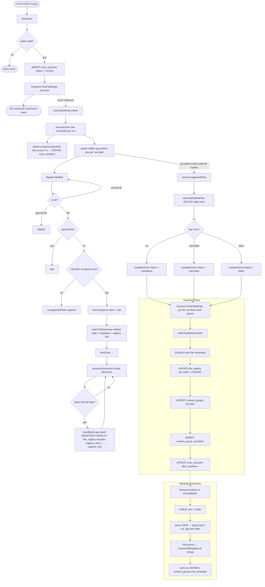

# WanderSort Core Packages

The `pkg/` directory contains the core packages that power WanderSort's file discovery, classification, hashing, metadata extraction, and capture-group correlation pipeline.

---

## Package overview

| Package | Purpose |
| --- | --- |
| `pkg/core/scanner` | Discovers files on disk, classifies them, derives capture groups, and registers everything in PostgreSQL. |
| `pkg/core/classifier` | Determines file types by extension. Houses per-format EXIF structs (one per supported extension), the `Metadata` interface, `CommonMetadata` (all-string normalised struct), and generic `ParseFromBytes` / `ParseFromFile` functions. |
| `pkg/core/hasher` | Computes BLAKE3 hashes, groups identical files into content groups, and scores master-file candidates. |
| `pkg/exiftool` | Runs the `exiftool` CLI as a subprocess, parses JSON output into typed classifier structs, and converts them to `CommonMetadata`. Supports concurrent extraction via a worker pool. |

---

## How it works

### Phase 1 — Submission (synchronous, returns immediately)

1. The HTTP handler receives `POST /scans` with a list of `rootPaths`.
2. `StartScan` expands each path (`~` → absolute) and checks it exists on disk.
3. A `scan_sessions` row is inserted into PostgreSQL with `status = running` and a new `sessionID` (UUID).
4. A `ScanTaskArgs` job (carrying the `sessionID` + paths) is enqueued into **River**. This call returns immediately — no filesystem work happens yet.
5. The `sessionID` is returned to the caller as a `202 Accepted` so they can poll for status.

---

### Phase 2 — Execution (async, inside River worker goroutine)

1. River dequeues the job and calls `ScanTaskWorker.Work`, which calls `executeScan`.
2. A fresh `scanState` struct is allocated — all counters and path slices live here, not on the `Scanner` struct. This makes fully concurrent scans safe with zero locking on `Scanner`.
3. A **progress goroutine** is spawned. Every 5 seconds it reads the atomic counters from `scanState` and writes them to the `scan_sessions` row so the client can see live progress.

---

### Phase 3 — Walking + Capture Grouping (concurrent)

1. One goroutine is spawned per root path, each running `filepath.WalkDir`.
2. For every filesystem entry the walker:
    - Skips entire directories that match the ignore-list (e.g. `.git`, `node_modules`).
    - Skips individual files that match the ignore-list (e.g. `.DS_Store`).
    - Runs the file extension through `FileClassifier`.
    - **Unsupported extension** → absolute path is appended to `unsupportedPaths` (protected by a `sync.Mutex`).
    - **Supported extension** → `DeriveCapture(filename, ext, mediaType)` computes the **capture stem** and **capture role**, then a `FileDiscovery` record (relative path, size, mod-time, media type, capture stem, capture role) is sent to `filesChan`.

#### Capture grouping

`DeriveCapture` normalises variant prefixes and determines each file's role in its capture group:

| Filename | Capture Stem | Capture Role |
| --- | --- | --- |
| `IMG_3162.HEIC` | `IMG_3162` | `ORIGINAL` |
| `IMG_3162.MOV` | `IMG_3162` | `LIVE_VIDEO` |
| `IMG_3162.AAE` | `IMG_3162` | `SIDECAR` |
| `IMG_E3162.HEIC` | `IMG_3162` | `EDITED` |
| `IMG_E3162.MOV` | `IMG_3162` | `EDITED_VIDEO` |
| `IMG_O3162.AAE` | `IMG_3162` | `ORIGINAL_SIDECAR` |
| `_MG_1721.JPG` | `_MG_1721` | `ORIGINAL` |
| `_MG_1721.CR2` | `_MG_1721` | `RAW` |

The capture group is a **virtual grouping** — no extra table is needed. Files sharing the same `(capture_stem, source_root)` belong to the same capture event.

---

### Phase 4 — Batch insert (concurrent with walking)

1. `processDiscoveries` reads from `filesChan` and buffers records up to a batch size of **500**.
2. Each full batch (and the final partial batch) is sent to `insertBatch`, which opens a pgx transaction and fires an `INSERT … ON CONFLICT DO UPDATE` for every file — including `capture_stem` and `capture_role`.
3. The `RETURNING (discovered_at = last_seen_at) AS is_new` expression lets each row report whether it was a brand-new file or an existing one — counters are updated atomically.

---

### Phase 5 — Post-walk cleanup

1. **Unsupported-file report** — once all walkers finish, `writeUnsupportedFiles` sorts `unsupportedPaths` alphabetically and writes them to `OUTPUT_PATH/unsupported_files_<sessionID>.txt`. No file is created if every file was classifiable.
2. **Stale-entry cleanup** — `cleanupDeletedFiles` deletes any `file_registry` rows whose `source_root` matches this scan but whose `scan_session_id` is from an earlier run (i.e. the file was not seen this time — it was deleted from disk).
3. **Session finalisation** — `completeScan` writes the final counters and sets `status` to `completed`, `cancelled`, or `failed` depending on whether any errors were encountered.

---

### Phase 6 — Hashing + Content Grouping (async, River worker per file)

1. After scanning completes, each discovered file is enqueued as a `HashTaskArgs` job on the `hash` River queue.
2. `HashTaskWorker.Work` calls `Hasher.ProcessFile`, which:
    - Computes a **BLAKE3** hash of the file contents (streaming, constant memory).
    - Updates `file_registry.file_hash` and sets `scan_status = 'HASHED'`.
    - Upserts a `content_groups` row keyed by the hash (`INSERT … ON CONFLICT` — concurrency safe).
    - Adds the file to `content_group_members`.
3. The `scan_sessions.files_hashed` counter is incremented per completed job.

Content groups represent **true duplicates** (identical bytes, identical hash). This is orthogonal to capture groups (same shutter press, different formats).

---

### Phase 7 — Metadata extraction (on demand, concurrent)

The `pkg/exiftool` package wraps the `exiftool` CLI for EXIF/metadata extraction:

1. `Extractor.Extract(ctx, path)` runs `exiftool -json -n <path>` as a subprocess, parses the JSON array, dispatches to the correct typed struct (e.g. `classifier.Jpg`, `classifier.Heic`), and calls `ToCommon()` to produce a `classifier.CommonMetadata` (all-string, absent fields = `""`).
2. `Extractor.ExtractBatch(ctx, paths)` fans extraction across `Config.Workers` goroutines (default 4), returning results in input order.
3. Each typed struct (11 types: jpg, jpeg, heic, png, bmp, webp, cr2, dng, mp4, mov, aae) implements the `Metadata` interface (`MediaType() string` + `ToCommon() CommonMetadata`).
4. Extracted metadata can be stored as JSONB in `content_groups.exif_metadata`.

---

## Sequence diagram

```mermaid
sequenceDiagram
    actor Client as HTTP Client
    participant H as Handler
    participant Svc as Service
    participant Sc as Scanner
    participant DB as PostgreSQL
    participant Q as River Queue
    participant SW as ScanTaskWorker
    participant HW as HashTaskWorker
    participant Ha as Hasher
    participant Ex as Extractor (exiftool)
    participant FS as Filesystem

    Client->>H: POST /scans {rootPaths}
    H->>Svc: StartScan(rootPaths)
    Svc->>Sc: StartScan(rootPaths)

    rect rgb(25,25,25)
        note over Sc,DB: Phase 1 — prepareSession
        Sc->>Sc: ExpandPath / os.Stat (validate)
        Sc->>DB: INSERT scan_sessions (status=running)
        DB-->>Sc: sessionID
    end

    Sc->>Q: Enqueue(ScanTaskArgs{sessionID, paths})
    Sc-->>H: sessionID
    H-->>Client: 202 Accepted {sessionID}

    note over Q,SW: Phase 2 — async River worker

    Q->>SW: Work(job)
    SW->>Sc: executeScan(session, expandedRoots)

    rect rgb(30,25,30)
        note over Sc,FS: Phase 3 — concurrent walking + capture grouping
        par Walker goroutines
            Sc->>FS: filepath.WalkDir(root₁)
            FS-->>Sc: file entries
        and
            Sc->>FS: filepath.WalkDir(rootₙ)
            FS-->>Sc: file entries
        end
        note over Sc: classify → DeriveCapture(stem, role) → FileDiscovery
        note over Sc: unsupported → unsupportedPaths[]
        note over Sc: supported → filesChan
    end

    loop every 5 s (progress goroutine)
        Sc->>DB: UPDATE scan_sessions (counters)
    end

    rect rgb(35,35,30)
        note over Sc,DB: Phase 4 — batch insert (with capture_stem + capture_role)
        loop batches of 500
            Sc->>DB: pgx batch INSERT/ON CONFLICT file_registry
            DB-->>Sc: is_new per row
        end
    end

    Sc->>Sc: writeUnsupportedFiles → OUTPUT_PATH/unsupported_files_<id>.txt
    Sc->>DB: DELETE file_registry WHERE source_root in paths AND session != current
    Sc->>DB: UPDATE scan_sessions (status=completed, final counters)

    rect rgb(25,30,35)
        note over Q,Ha: Phase 6 — hashing + content grouping (River hash queue)
        Q->>HW: Work(HashTaskArgs{fileID, path})
        HW->>Ha: ProcessFile(fileID, path)
        Ha->>FS: read file (streaming)
        Ha->>Ha: BLAKE3 hash
        Ha->>DB: UPDATE file_registry SET file_hash, status=HASHED
        Ha->>DB: UPSERT content_groups (by hash)
        Ha->>DB: INSERT content_group_members
        Ha->>DB: UPDATE scan_sessions files_hashed++
    end

    rect rgb(30,35,25)
        note over Ex,FS: Phase 7 — metadata extraction (concurrent workers)
        Ex->>FS: exiftool -json -n <path>
        FS-->>Ex: JSON output
        Ex->>Ex: parse → typed struct → ToCommon()
        Ex-->>DB: store CommonMetadata as JSONB
    end
```



---

## Pipeline flowchart



---

## Data model: two orthogonal grouping dimensions

```txt
file_registry
├── capture_stem + source_root  →  Capture Group (same shutter press, different formats)
│   e.g. IMG_3162.HEIC + IMG_3162.MOV + IMG_3162.AAE + IMG_E3162.HEIC
│
└── file_hash → content_groups  →  Content Group (identical bytes, true duplicates)
    e.g. same IMG_3162.HEIC found in ~/Photos and ~/Backup
```

| Dimension | Key | What it means | Stored as |
| --- | --- | --- | --- |
| **Capture group** | `(capture_stem, source_root)` | Files from the same camera event: original, raw, live video, sidecar, edited variants | Columns on `file_registry` — virtual grouping via query |
| **Content group** | `content_hash` | Byte-identical files across any location | `content_groups` + `content_group_members` tables |

---

## Key design decisions

| Decision | Reason |
| --- | --- |
| `Scanner` is stateless | All per-scan mutable state lives in `scanState`, allocated fresh per `executeScan` call. Multiple concurrent scans never share memory. |
| `Enqueuer` interface on `Scanner` | `scanner` defines what it needs; `queue` provides it. No circular import. |
| `queue.Worker` interface | Any package can register a worker by implementing `Register` + `SetEnqueuer`. `queue.New` handles wiring with zero knowledge of domain types. |
| Async via River | `StartScan` returns a `sessionID` immediately. Clients poll `GET /scans/:id`. The actual walk runs in a River worker goroutine, bounded by `MaxConcurrentScans`. |
| pgx batch inserts | Sending all rows in a single round-trip via `pgx.Batch` is significantly faster than individual `INSERT` calls. |
| Capture groups as columns, not a table | `capture_stem` + `capture_role` on `file_registry` avoids an extra join table. Querying `WHERE capture_stem = X AND source_root = Y` is fast with a composite index. |
| Content groups via hash | BLAKE3 streaming hash with `INSERT … ON CONFLICT` makes concurrent hashers safe with no TOCTOU races. |
| `CommonMetadata` is all strings | No computation on metadata values — they are stored and displayed. Absent fields default to `""`. Type-specific structs handle the original types from exiftool. |
| `Metadata` interface with generics | `ParseFromBytes[T Metadata]` + `ToCommon()` gives type-safe parsing per format with a single common output type. |
| Concurrent exiftool extraction | `Extractor.ExtractBatch` fans out across N workers, each spawning its own `exiftool` subprocess. Results returned in input order. |
