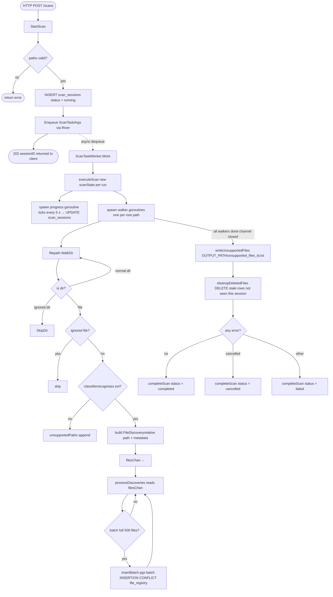

# Scanner Package

`pkg/core/scanner` is the heart of WanderSort. It discovers files on disk, registers them in PostgreSQL, and produces an unsupported-file report for anything it cannot classify.

---

## How it works

### Phase 1 — Submission (synchronous, returns immediately)

1. The HTTP handler receives `POST /scans` with a list of `rootPaths`.
2. `StartScan` expands each path (`~` → absolute) and checks it exists on disk.
3. A `scan_sessions` row is inserted into PostgreSQL with `status = running` and a new `sessionID` (UUID).
4. A `ScanTaskArgs` job (carrying the `sessionID` + paths) is enqueued into **River**. This call returns immediately — no filesystem work happens yet.
5. The `sessionID` is returned to the caller as a `202 Accepted` so they can poll for status.

---

### Phase 2 — Execution (async, inside River worker goroutine)

1. River dequeues the job and calls `ScanTaskWorker.Work`, which calls `executeScan`.
2. A fresh `scanState` struct is allocated — all counters and path slices live here, not on the `Scanner` struct. This makes fully concurrent scans safe with zero locking on `Scanner`.
3. A **progress goroutine** is spawned. Every 5 seconds it reads the atomic counters from `scanState` and writes them to the `scan_sessions` row so the client can see live progress.

---

### Phase 3 — Walking (concurrent)

1. One goroutine is spawned per root path, each running `filepath.WalkDir`.
2. For every filesystem entry the walker:
    - Skips entire directories that match the ignore-list (e.g. `.git`, `node_modules`).
    - Skips individual files that match the ignore-list (e.g. `.DS_Store`).
    - Runs the file extension through `FileClassifier`.
    - **Unsupported extension** → absolute path is appended to `unsupportedPaths` (protected by a `sync.Mutex`).
    - **Supported extension** → a `FileDiscovery` record (relative path, size, mod-time, media type) is sent to `filesChan`.

---

### Phase 4 — Batch insert (concurrent with walking)

1. `processDiscoveries` reads from `filesChan` and buffers records up to a batch size of **500**.
2. Each full batch (and the final partial batch) is sent to `insertBatch`, which opens a pgx transaction and fires an `INSERT … ON CONFLICT DO UPDATE` for every file.
3. The `RETURNING (discovered_at = last_seen_at) AS is_new` expression lets each row report whether it was a brand-new file or an existing one — counters are updated atomically.

---

### Phase 5 — Post-walk cleanup

1. **Unsupported-file report** — once all walkers finish, `writeUnsupportedFiles` sorts `unsupportedPaths` alphabetically and writes them to `OUTPUT_PATH/unsupported_files_<sessionID>.txt`. No file is created if every file was classifiable.
2. **Stale-entry cleanup** — `cleanupDeletedFiles` deletes any `file_registry` rows whose `source_root` matches this scan but whose `scan_session_id` is from an earlier run (i.e. the file was not seen this time — it was deleted from disk).
3. **Session finalisation** — `completeScan` writes the final counters and sets `status` to `completed`, `cancelled`, or `failed` depending on whether any errors were encountered.

---

## Sequence diagram

```mermaid
sequenceDiagram
    actor Client as HTTP Client
    participant H as Handler
    participant Svc as Service
    participant Sc as Scanner
    participant DB as PostgreSQL
    participant Q as River Queue
    participant W as ScanTaskWorker
    participant FS as Filesystem

    Client->>H: POST /scans {rootPaths}
    H->>Svc: StartScan(rootPaths)
    Svc->>Sc: StartScan(rootPaths)

    rect rgb(25,25,25)
        note over Sc,DB: prepareSession
        Sc->>Sc: ExpandPath / os.Stat (validate)
        Sc->>DB: INSERT scan_sessions (status=running)
        DB-->>Sc: sessionID
    end

    Sc->>Q: Enqueue(ScanTaskArgs{sessionID, paths})
    Sc-->>H: sessionID
    H-->>Client: 202 Accepted {sessionID}

    note over Q,W: async — River worker goroutine

    Q->>W: Work(job)
    W->>Sc: executeScan(session, expandedRoots)

    rect rgb(30,25,30)
        note over Sc,FS: concurrent walking (one goroutine per root)
        par Walker goroutines
            Sc->>FS: filepath.WalkDir(root₁)
            FS-->>Sc: file entries
        and
            Sc->>FS: filepath.WalkDir(rootₙ)
            FS-->>Sc: file entries
        end
        note over Sc: skips ignored dirs/files, classifies each file
        note over Sc: unsupported → unsupportedPaths[]
        note over Sc: supported → filesChan
    end

    loop every 5 s (progress goroutine)
        Sc->>DB: UPDATE scan_sessions (counters)
    end

    rect rgb(35,35,30)
        note over Sc,DB: batch processor (reads filesChan)
        loop batches of 500
            Sc->>DB: pgx batch INSERT/ON CONFLICT file_registry
            DB-->>Sc: is_new per row
        end
    end

    Sc->>Sc: writeUnsupportedFiles → OUTPUT_PATH/unsupported_files_<id>.txt
    Sc->>DB: DELETE file_registry WHERE source_root in paths AND session != current
    Sc->>DB: UPDATE scan_sessions (status=completed, final counters)
```

---

## Pipeline flowchart

---

## Key design decisions

| Decision | Reason |
| --- | --- |
| `Scanner` is stateless | All per-scan mutable state lives in `scanState`, allocated fresh per `executeScan` call. Multiple concurrent scans never share memory. |
| `Enqueuer` interface on `Scanner` | `scanner` defines what it needs; `queue` provides it. No circular import. |
| `queue.Worker` interface | Any package can register a worker by implementing `Register` + `SetEnqueuer`. `queue.New` handles wiring with zero knowledge of domain types. |
| Async via River | `StartScan` returns a `sessionID` immediately. Clients poll `GET /scans/:id`. The actual walk runs in a River worker goroutine, bounded by `MaxConcurrentScans`. |
| pgx batch inserts | Sending all rows in a single round-trip via `pgx.Batch` is significantly faster than individual `INSERT` calls. |
